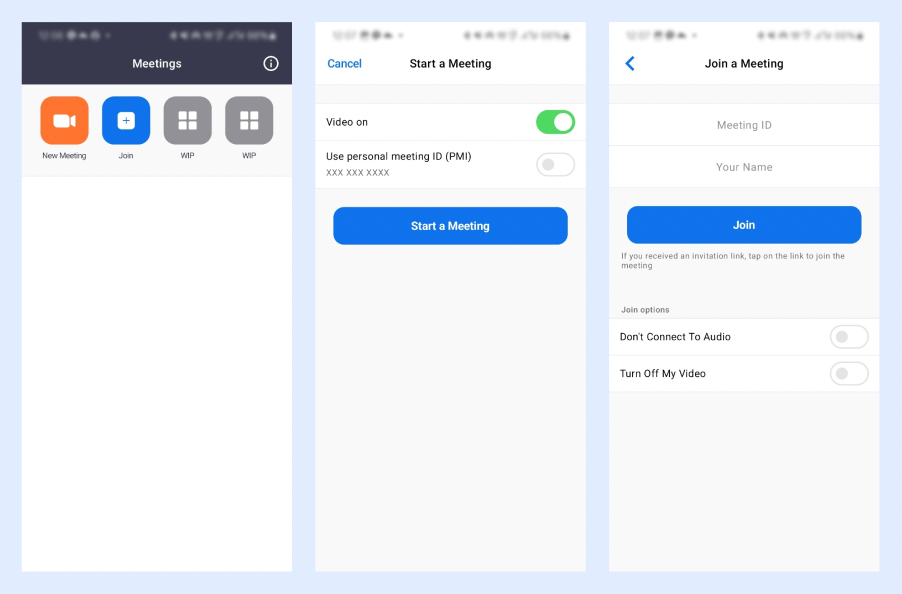

<p align="center">
  <a href="https://opensource.org/licenses/Apache-2.0"></a>
  <a href="https://android-arsenal.com/api?level=26"></a>
  <a href="https://github.com/wisemuji/zoom-clone-compose/actions/workflows/android.yml"></a>
  <a href="https://mailchi.mp/kotlinweekly/kotlin-weekly-399"></a>
</p>

This is a [Zoom](https://zoom.us/) clone app built with __[Stream Video SDK for Compose](https://getstream.io/video/sdk/android/?utm_source=Github&utm_medium=external_write[…]_campaign=Github_Mar2024_ZoomAndroidClone&utm_term=suhyeon)__ to implement real-time video meeting features using Jetpack Compose.

The goal of this repository is to showcase the following:

- The development of comprehensive UI elements utilizing Jetpack Compose.
- The use of Android architecture components alongside Jetpack libraries, including androidx ViewModel and Hilt.
- Execution of background operations using Kotlin Coroutines.
- Integration of real-time video meeting room functionalities through the Stream Video SDK, powered by WebRTC technology.

## ✍️ Technical Content

If you're interested in building this project from the scratch, check out the blog posts below:

- **[Build a Real-Time Zoom Clone with Jetpack Compose](https://getstream.io/blog/zoom-clone-compose/)**

## 📲 Download APK
Go to the [Releases](https://github.com/wisemuji/zoom-clone-compose/releases) to download the latest APK.

<a href="https://getstream.io/video/sdk/android/?utm_source=Github&utm_medium=external_write[…]_campaign=Github_Mar2024_ZoomAndroidClone&utm_term=suhyeon">

</a>

## 🛥 Stream Video SDK
**Zoom Clone Compose** is built with __[Stream Video SDK for Compose](https://getstream.io/video/sdk/android/?utm_source=Github&utm_medium=external_write[…]_campaign=Github_Mar2024_ZoomAndroidClone&utm_term=suhyeon)__ to implement a real-time video meeting features. If you’re interested in adding powerful In-App Video calling, audio room, livestreaming to your app, check out the __[Android Video Calling Tutorial](https://getstream.io/video/sdk/android/tutorial/video-calling/?utm_source=Github&utm_medium=external_write[…]_campaign=Github_Mar2024_ZoomAndroidClone&utm_term=suhyeon)__!

### Stream Video

- [Stream Video SDK for Android on GitHub](https://github.com/getstream/stream-video-android?utm_source=Github&utm_medium=external_write[…]_campaign=Github_Mar2024_ZoomAndroidClone&utm_term=suhyeon)
- [Video Call Tutorial](https://getstream.io/video/docs/android/tutorials/video-calling?utm_source=Github&utm_medium=external_write[…]_campaign=Github_Mar2024_ZoomAndroidClone&utm_term=suhyeon)
- [Audio Room Tutorial](https://getstream.io/video/docs/android/tutorials/audio-room?utm_source=Github&utm_medium=external_write[…]_campaign=Github_Mar2024_ZoomAndroidClone&utm_term=suhyeon)
- [Livestream Tutorial](https://getstream.io/video/docs/android/tutorials/livestream?utm_source=Github&utm_medium=external_write[…]_campaign=Github_Mar2024_ZoomAndroidClone&utm_term=suhyeon)

## 📷 Previews




## 💻 Build Your Own Chat Project

If you want to build your own chat project, you should follow the instructions below:

1. Go to the __[Stream login page](https://getstream.io/try-for-free?utm_source=Github&utm_medium=external_write[…]_campaign=Github_Mar2024_ZoomAndroidClone&utm_term=suhyeon)__.
2. If you have your GitHub account, click the **SIGN UP WITH GITHUB** button and you can sign up within a couple of seconds.


3. If you don't have a GitHub account, fill in the inputs and click the **START FREE TRIAL** button.
4. Go to the __[Dashboard](https://dashboard.getstream.io?utm_source=Github&utm_medium=external_write[…]_campaign=Github_Mar2024_ZoomAndroidClone&utm_term=suhyeon)__ and click the **Create App** button like the below.


5. Fill in the blanks like the below and click the **Create App** button.


6. You will see the **Key** like the figure below and then copy it.


7. Create a `secrets.properties` file on the root project directory with the text below using your API key:

```
STREAM_API_KEY=REPLACE WITH YOUR API KEY
```

8. Build and run the project.

## 🛠 Tech Stack & Open Source Libraries
- Minimum SDK level 26.
- 100% [Jetpack Compose](https://developer.android.com/jetpack/compose) based + [Coroutines](https://github.com/Kotlin/kotlinx.coroutines) + [Flow](https://kotlin.github.io/kotlinx.coroutines/kotlinx-coroutines-core/kotlinx.coroutines.flow/) for asynchronous.
- [Compose Video SDK for Real-Time Meeting](https://getstream.io/video/docs/android/tutorials/video-calling?utm_source=Github&utm_medium=external_write[…]_campaign=Github_Mar2024_ZoomAndroidClone&utm_term=suhyeon): The Jetpack Compose Chat Messaging SDK is built on a low-level chat client and provides modular, customizable Compose UI components that you can easily drop into your app.
- Jetpack
  - Compose: Android’s modern toolkit for building native UI.
  - ViewModel: UI related data holder and lifecycle aware.
  - Navigation: For navigating screens and [Hilt Navigation Compose](https://developer.android.com/jetpack/compose/libraries#hilt) for injecting dependencies.
  - [Hilt](https://dagger.dev/hilt/): Dependency Injection.
- [Spotless gradle plugin](https://github.com/diffplug/spotless/tree/main/plugin-gradle) for formatting kotlin files.

## 🤝 Contribution

Most of the features are not completed except the chat feature, so anyone can contribute and improve this project following the [Contributing Guideline](https://github.com/wisemuji/zoom-clone-compose/blob/main/CONTRIBUTING.md).

# License
```xml
Copyright 2024 Suhyeon(wisemuji) and Stream.IO, Inc. All Rights Reserved.

Licensed under the Apache License, Version 2.0 (the "License");
you may not use this file except in compliance with the License.
You may obtain a copy of the License at

   http://www.apache.org/licenses/LICENSE-2.0

Unless required by applicable law or agreed to in writing, software
distributed under the License is distributed on an "AS IS" BASIS,
WITHOUT WARRANTIES OR CONDITIONS OF ANY KIND, either express or implied.
See the License for the specific language governing permissions and
limitations under the License.
```
